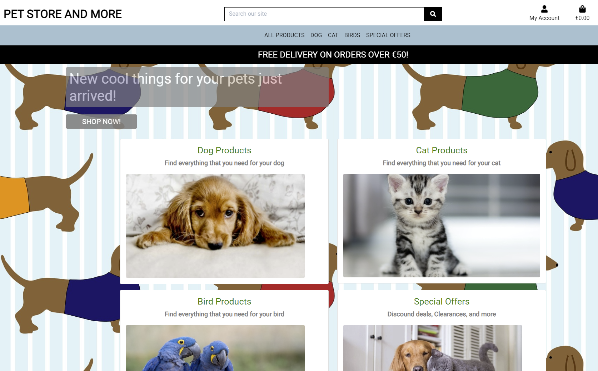
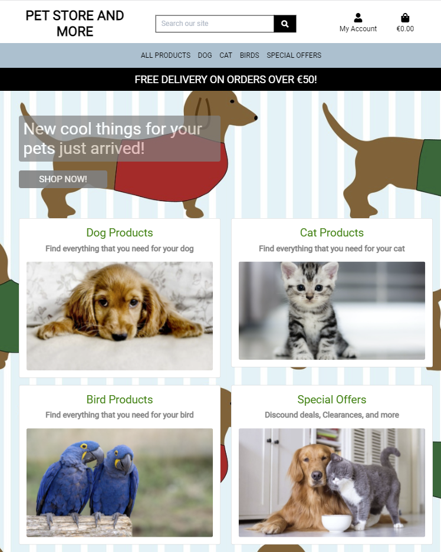
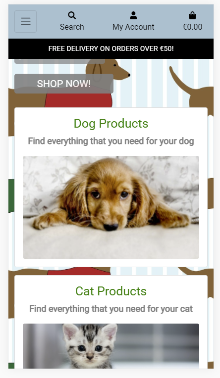
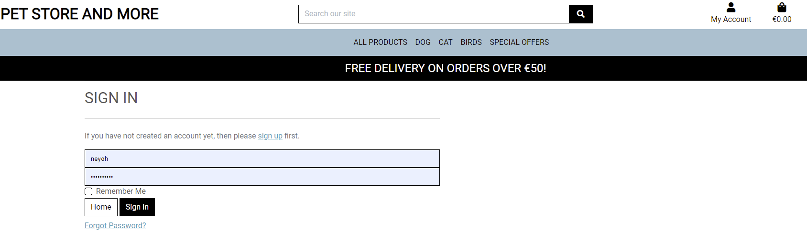
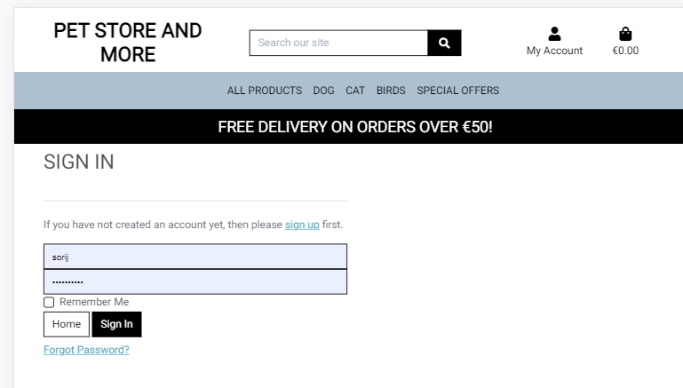
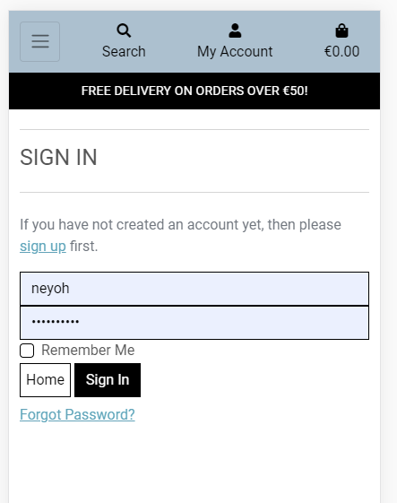

# 
Testing for [Pet Store and More e-Comerce Website](https://pet-store-and-more.herokuapp.com/)

## Table of Contents
### 1. [UX](#ux)
### 2. [Features](#features)
### 3. [Information Architecture](#information-architecture)
### 4. [Technologies Used](#technologies-used)
### 5. [Testing](#testing)
### 6. [Deployment](#deployment)

## UX
### User stories:

- As a user, I want an easy way to navigate a website.

  - user goes to the website and on all the pages, there is a simple navigation bar fixed on the top of the page.
  
  - Even when not logged in, user can see the products.

    - User can search the website by using a search field.

    - User can select All products, specific products in a certain category or Special Offers.
  
  - When logged in, user can also see its Profile page, where it can update Shipping info and also can see the Order History.

- As a user, I want to be able to use it on desktop, tablet and mobile devices.

  - users who are browsing with Chrome, Safari, Firefox and IE can use the website on desktop, tablet and mobile views with full responsiveness.

- As a user, I want to be able to successfully register/login

  - Go to the home page and register or login.

## Features
## [Home](https://pet-store-and-more.herokuapp.com/) in Desktop view.

In desktop mode, the search bar is located on the top of the page.

In the upper right corner, there are two icons, one for Account (Login/Registration) and second a shopping bag.

No matter if user is login or not, just below the search bar there is a navigation bar.

There is also a status message which tells user for a special promotion.

User can click on 'Shop Now' button which will take him/her to All products page.

User also can click on any of the major Categories (Dog, Cat, Bird, or Secial Offers)

## [Home](https://pet-store-and-more.herokuapp.com/) in iPad/iPad Pro view.

In tablet mode, the search bar is located on the top of the page.

In the upper right corner, there are two icons, one for Account (Login/Registration) and second a shopping bag.

No matter if user is login or not, just below the search bar there is a navigation bar.

There is also a status message which tells user for a special promotion.

User can click on 'Shop Now' button which will take him/her to All products page.

User also can click on any of the major Categories (Dog, Cat, Bird, or Secial Offers)

## [Home](https://pet-store-and-more.herokuapp.com/) in iPhone X, 5, 6, 7, 8 view.

In mobile mode, in the upper left side there is a dropdown button which when clicked, opens a navigation pane.

In the upper middle section, there is a search bar button, which when clicked produces search bar.

In the upper right corner, there are two icons, one for Account (Login/Registration) and second a shopping bag.

User can click on 'Shop Now' button which will take him/her to All products page.

User also can click on any of the major Categories (Dog, Cat, Bird, or Secial Offers)

## [Login](https://pet-store-and-more.herokuapp.com/accounts/login/) in Desktop view.

In desktop mode, the search bar is located on the top of the page.

The navigation menu bar on the top is fixed and the words are clearly displayed.

No matter if user is login or not, just below the search bar there is a navigation bar.

There is also a status message which tells user for a special promotion.

User must enter username and password credentials in order to login.

There is an option to remember username and password.

There is also link to sign up in case the user never registered, and link to reset password in case user can't remember its password.

## [Login](https://pet-store-and-more.herokuapp.com/accounts/login/) in iPad/iPad Pro view.

In tablet mode, the search bar is located on the top of the page.

In the upper right corner, there are two icons, one for Account (Login/Registration) and second a shopping bag.

No matter if user is login or not, just below the search bar there is a navigation bar.

There is also a status message which tells user for a special promotion.

User must enter username and password credentials in order to login.

There is an option to remember username and password.

There is also link to sign up in case the user never registered, and link to reset password in case user can't remember its password.

## [Login](https://pet-store-and-more.herokuapp.com/accounts/login/) in iPhone X, 5, 6, 7, 8 view.

In mobile mode, in the upper left side there is a dropdown button which when clicked, opens a navigation pane.

In the upper middle section, there is a search bar button, which when clicked produces search bar.

In the upper right corner, there are two icons, one for Account (Login/Registration) and second a shopping bag.

User must enter username and password credentials in order to login.

There is an option to remember username and password.

There is also link to sign up in case the user never registered, and link to reset password in case user can't remember its password.
## [Signup](https://pet-store-and-more.herokuapp.com/accounts/signup/) in Desktop view.

In desktop mode, the search bar is located on the top of the page.

The navigation menu bar on the top is fixed and the words are clearly displayed.

No matter if user is login or not, just below the search bar there is a navigation bar.

There is also a status message which tells user for a special promotion.

User must enter its email address and to confirm for security purposes.

User must enter username, which must be unique.

User must enter password twice and they must match.

There is a link to login in case the user already registered.

## [Signup](https://pet-store-and-more.herokuapp.com/accounts/signup/) in iPad/iPad Pro view.

In tablet mode, the search bar is located on the top of the page.

In the upper right corner, there are two icons, one for Account (Login/Registration) and second a shopping bag.

No matter if user is login or not, just below the search bar there is a navigation bar.

There is also a status message which tells user for a special promotion.

User must enter its email address and to confirm for security purposes.

User must enter username, which must be unique.

User must enter password twice and they must match.

There is a link to login in case the user already registered.
## [Signup](https://pet-store-and-more.herokuapp.com/accounts/signup/) in iPhone X, 5, 6, 7, 8 view.

In mobile mode, in the upper left side there is a dropdown button which when clicked, opens a navigation pane.

In the upper middle section, there is a search bar button, which when clicked produces search bar.

In the upper right corner, there are two icons, one for Account (Login/Registration) and second a shopping bag.

User must enter its email address and to confirm for security purposes.

User must enter username, which must be unique.

User must enter password twice and they must match.

There is a link to login in case the user already registered.
## [Profile](https://pet-store-and-more.herokuapp.com/profile/) in Desktop view.

In desktop mode, the search bar is located on the top of the page.

The navigation menu bar on the top is fixed and the words are clearly displayed.

No matter if user is login or not, just below the search bar there is a navigation bar.

There is also a status message which tells user for a special promotion.

When clicked on My Account -> My Profile after being logged in, a "My Profile" page will be displayed, where the user can enter the following:

- Phone number
- Country
- Street Address
- Town or City
- Aircode
- County

User can update the above mentioned attributes by clicking on Update Info button

On this page, user can also review its Order History.

## [Profile](https://pet-store-and-more.herokuapp.com/profile/) in iPad/iPad Pro view.

In tablet mode, the search bar is located on the top of the page.

In the upper right corner, there are two icons, one for Account (Login/Registration) and second a shopping bag.

No matter if user is login or not, just below the search bar there is a navigation bar.

There is also a status message which tells user for a special promotion.

When clicked on My Account -> My Profile after being logged in, a "My Profile" page will be displayed, where the user can enter the following:

- Phone number
- Country
- Street Address
- Town or City
- Aircode
- County

User can update the above mentioned attributes by clicking on Update Info button

On this page, user can also review its Order History.
## [Profile](https://pet-store-and-more.herokuapp.com/profile/) in iPhone X, 5, 6, 7, 8 view.

In mobile mode, in the upper left side there is a dropdown button which when clicked, opens a navigation pane.

In the upper middle section, there is a search bar button, which when clicked produces search bar.

In the upper right corner, there are two icons, one for Account (Login/Registration) and second a shopping bag.

When clicked on My Account -> My Profile after being logged in, a "My Profile" page will be displayed, where the user can enter the following:

- Phone number
- Country
- Street Address
- Town or City
- Aircode
- County

User can update the above mentioned attributes by clicking on Update Info button

On this page, user can also review its Order History.

## [All Products](https://pet-store-and-more.herokuapp.com/products/) in Desktop view.

In desktop mode, the search bar is located on the top of the page.

The navigation menu bar on the top is fixed and the words are clearly displayed.

No matter if user is login or not, just below the search bar there is a navigation bar.

There is also a status message which tells user for a special promotion.

You can sort out products based on the following:

  - Price (low to high)
  - Price (high to low)
  - Rating (low to high)
  - Rating (high to low)
  - Name (A-Z)
  - Name (Z-A)
  - Price (A-Z)
  - Price (Z-A)

Each product has the following attributes shown:

  - Name
  - Price
  - Category
  - Rating
  - Edit (Admini Only)
  - Delete (Admin Only)

Products are displayed 4 in a row.
## [All Products](https://pet-store-and-more.herokuapp.com/products/) in iPad/iPad Pro view.

In tablet mode, the search bar is located on the top of the page.

In the upper right corner, there are two icons, one for Account (Login/Registration) and second a shopping bag.

No matter if user is login or not, just below the search bar there is a navigation bar.

There is also a status message which tells user for a special promotion.

You can sort out products based on the following:

  - Price (low to high)
  - Price (high to low)
  - Rating (low to high)
  - Rating (high to low)
  - Name (A-Z)
  - Name (Z-A)
  - Price (A-Z)
  - Price (Z-A)

Each product has the following attributes shown:

  - Name
  - Price
  - Category
  - Rating
  - Edit (Admini Only)
  - Delete (Admin Only)

Products are displayed 2 (iPad) or 3 (iPad Pro) in a row.

## [All Products](https://pet-store-and-more.herokuapp.com/products/) in iPhone X, 5, 6, 7, 8 view.

In mobile mode, in the upper left side there is a dropdown button which when clicked, opens a navigation pane.

In the upper middle section, there is a search bar button, which when clicked produces search bar.

In the upper right corner, there are two icons, one for Account (Login/Registration) and second a shopping bag.

You can sort out products based on the following:

  - Price (low to high)
  - Price (high to low)
  - Rating (low to high)
  - Rating (high to low)
  - Name (A-Z)
  - Name (Z-A)
  - Price (A-Z)
  - Price (Z-A)

Each product has the following attributes shown:

  - Name
  - Price
  - Category
  - Rating
  - Edit (Admini Only)
  - Delete (Admin Only)

Products are displayed 1 in a row.
## [Specific Pet Example] (https://pet-store-and-more.herokuapp.com/products/?category=dry_dog_food,wet_dog_food,dog_treats,dog_toys_training,dog_beds,dog_supplements) in Desktop view.

In desktop mode, the search bar is located on the top of the page.

The navigation menu bar on the top is fixed and the words are clearly displayed.

No matter if user is login or not, just below the search bar there is a navigation bar.

There is also a status message which tells user for a special promotion.

There is a section where user can click on a specific item selection under the Specific Pet Type.

Click on a button will take user to a specific selection of products.

You can sort out products based on the following:

  - Price (low to high)
  - Price (high to low)
  - Rating (low to high)
  - Rating (high to low)
  - Name (A-Z)
  - Name (Z-A)
  - Price (A-Z)
  - Price (Z-A)

Each product has the following attributes shown:

  - Name
  - Price
  - Category
  - Rating
  - Edit (Admini Only)
  - Delete (Admin Only)

Products are displayed 4 in a row.
## [Specific Pet Example] (https://pet-store-and-more.herokuapp.com/products/?category=dry_dog_food,wet_dog_food,dog_treats,dog_toys_training,dog_beds,dog_supplements) in iPad/iPad Pro view.

In tablet mode, the search bar is located on the top of the page.

In the upper right corner, there are two icons, one for Account (Login/Registration) and second a shopping bag.

No matter if user is login or not, just below the search bar there is a navigation bar.

There is also a status message which tells user for a special promotion.

There is a section where user can click on a specific item selection under the Specific Pet Type.

Click on a button will take user to a specific selection of products.

You can sort out products based on the following:

  - Price (low to high)
  - Price (high to low)
  - Rating (low to high)
  - Rating (high to low)
  - Name (A-Z)
  - Name (Z-A)
  - Price (A-Z)
  - Price (Z-A)

Each product has the following attributes shown:

  - Name
  - Price
  - Category
  - Rating
  - Edit (Admini Only)
  - Delete (Admin Only)

Products are displayed 2 (iPad) or 3 (iPad Pro) in a row.

## [Specific Pet Example] (https://pet-store-and-more.herokuapp.com/products/?category=dry_dog_food,wet_dog_food,dog_treats,dog_toys_training,dog_beds,dog_supplements) in iPhone X, 5, 6, 7, 8 view.

In mobile mode, in the upper left side there is a dropdown button which when clicked, opens a navigation pane.

In the upper middle section, there is a search bar button, which when clicked produces search bar.

In the upper right corner, there are two icons, one for Account (Login/Registration) and second a shopping bag.

There is a section where user can click on a specific item selection under the Specific Pet Type.

Click on a button will take user to a specific selection of products.

You can sort out products based on the following:

  - Price (low to high)
  - Price (high to low)
  - Rating (low to high)
  - Rating (high to low)
  - Name (A-Z)
  - Name (Z-A)
  - Price (A-Z)
  - Price (Z-A)

Each product has the following attributes shown:

  - Name
  - Price
  - Category
  - Rating
  - Edit (Admini Only)
  - Delete (Admin Only)

Products are displayed 1 in a row.

## [Product] (https://pet-store-and-more.herokuapp.com/products/<product_id/) in Desktop view.

In desktop mode, the search bar is located on the top of the page.

The navigation menu bar on the top is fixed and the words are clearly displayed.

No matter if user is login or not, just below the search bar there is a navigation bar.

There is also a status message which tells user for a special promotion.

Each product has the following attributes shown:

  - Name
  - Price
  - Category
  - Rating
  - Edit (Admini Only)
  - Delete (Admin Only)
  - Description
  - Size
  - Quantity

Add to bag button to add item to user's shopping bag.

'Keep shopping' button to send user back to products page.
## [Product] (https://pet-store-and-more.herokuapp.com/products/<product_id/) in iPad/iPad Pro view.

In tablet mode, the search bar is located on the top of the page.

In the upper right corner, there are two icons, one for Account (Login/Registration) and second a shopping bag.

No matter if user is login or not, just below the search bar there is a navigation bar.

There is also a status message which tells user for a special promotion.

Each product has the following attributes shown:

  - Name
  - Price
  - Category
  - Rating
  - Edit (Admini Only)
  - Delete (Admin Only)
  - Description
  - Size
  - Quantity

Add to bag button to add item to user's shopping bag.

'Keep shopping' button to send user back to products page.
## [Product] (https://pet-store-and-more.herokuapp.com/products/<product_id/) in iPhone X, 5, 6, 7, 8 view.

In mobile mode, in the upper left side there is a dropdown button which when clicked, opens a navigation pane.

In the upper middle section, there is a search bar button, which when clicked produces search bar.

In the upper right corner, there are two icons, one for Account (Login/Registration) and second a shopping bag.

Each product has the following attributes shown:

  - Name
  - Price
  - Category
  - Rating
  - Edit (Admini Only)
  - Delete (Admin Only)
  - Description
  - Size
  - Quantity

Add to bag button to add item to user's shopping bag.

'Keep shopping' button to send user back to products page.

# Responsiveness on different browsers:

[Google Chrome](https://google.com) all the testing information has been tested on Chrome browser using DevTools.

[Mozilla Firefox](https://www.mozilla.org/en-GB/firefox/new/) and [Internet Explorer](https://www.microsoft.com/en-gb/download/internet-explorer.aspx) browsers responsiveness is good on desktop, tablet and phone.

[Safari](https://www.apple.com/uk/safari/) browser responsiveness is the same as Chrome browser, no bugs.